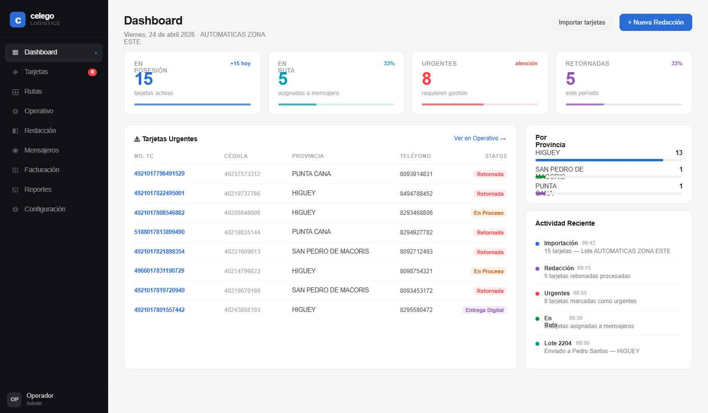

Prompt maestro del proyecto Celego
Este documento define de forma exhaustiva los requisitos y el contexto del proyecto Celego, un sistema para la gestión integral de mensajería de tarjetas de crédito y débito para un banco de la República Dominicana.  Se ha recopilado la información de los documentos de contexto, diseños y hojas de cálculo proporcionados por el usuario.  La finalidad de este documento es servir de referencia clara y detallada para que un modelo de programación (Codex) genere el código necesario siguiendo fielmente las expectativas del negocio.
Objetivo del proyecto
Construir un sistema web que controle de principio a fin la logística de entrega y devolución de tarjetas bancarias.  Este sistema debe:

Importar y procesar datos críticos: cargar listas de tarjetas con la información del cliente (cédula, nombre, dirección, teléfonos), el tipo de emisión, la fecha de despacho, la zona y otros campos definidos en los formatos de importación.  Los archivos de importación se proporcionan en formato Excel y el sistema debe reconocer la estructura exacta de las hojas de cálculo denominadas IMPORTAR_DATA_DIARIA, RETORNADAS/ENTREGADAS y URGENTES.

Gestionar estados de las tarjetas: asignar y modificar en masa los estados de cada tarjeta para reflejar su ciclo de vida.  Los estados iniciales son:

Despachada: tarjeta recibida del banco para su entrega.

Enviada a interior: la tarjeta ha sido remitida a una provincia (Santo Domingo, Higuey, Romana, San Pedro, Punta Cana, Santiago, San Francisco, San Cristóbal, Puerto Plata, Baní).

En ruta: el mensajero la lleva físicamente en la calle.

Entregada: entregada al cliente.

Retornada: la tarjeta fue devuelta; debe asociarse el motivo de devolución.

Crear perfiles de clientes: cada tarjeta se asocia a un cliente que puede recibir varios despachos.  El perfil debe incluir una bitácora con todos los cambios de estado y entregas anteriores.

Registrar zonas y tarifas: las entregas se tarifan según la zona (Metro, Este, Norte, Sur) y la cantidad de tarjetas entregadas.  El sistema debe permitir definir precios por zona y rangos de cantidad (mayoreo), ya que la facturación depende tanto de la zona como del volumen de entregas.

Emitir reportes en múltiples formatos: permitir generar reportes por zona, fecha de inicio/final, estado de entrega, etc., y exportarlos en Excel, CSV y PDF.  Los reportes deben seguir exactamente la estructura de las hojas de cálculo con prefijos REPORTE_EXPORT provistas por el usuario.

Gestionar mensajeros: crear perfiles de mensajeros (no son usuarios del sistema sino registros de nómina básica) con tarifas personalizadas por tipo de servicio:

Entregas normales.

Entregas en zonas remotas.

Recogidas a banco.

Mandados (servicios extra).
Cada mensajero puede tener tipos de entrega propios y tarifas diferentes.
El sistema debe generar reportes individuales por período en formato JPG que detallen el número de entregas de cada tipo por día y muestren de manera destacada el total generado para su pago.  Asimismo, debe registrar en un historial la fecha de generación y el rango de fechas de cada reporte.

Registro diario de gestiones: disponer de un módulo en el que el personal introduzca diariamente todas las entregas (normales, remotas, recogidas, mandados) de cada mensajero para controlar el avance.

Alertas de vencimiento (SLA): mostrar avisos para las tarjetas en posesión cuyo tiempo máximo de entrega esté por expirar.  El administrador podrá configurar el SLA (por defecto 5 días laborables, excluyendo fines de semana) y extenderlo para grupos específicos de tarjetas (por cédula o referencia).

Asignación de rutas: asignar de forma diaria a cada mensajero una ruta compuesta por tarjetas, identificadas por número de cédula o referencia externa.  Estas rutas deben poder consultarse por fecha y mensajero.

Operativos de llamadas: proporcionar un panel para realizar llamadas de seguimiento.  Debe filtrar tarjetas por provincia y días restantes de SLA (3, 2 o 1 día), excluir las tarjetas ya entregadas o retornadas y permitir al usuario:

Ver la información del cliente en un modal (nombre, cédula, ubicación de la tarjeta, teléfonos).

Marcar cuáles teléfonos se utilizaron (checkbox).

Añadir nuevos números y comentarios.

Marcar la tarjeta como “contactado”.

Pasar al siguiente cliente con un botón.
Posteriormente debe existir un reporte de contactos que muestre nombre, número marcado y comentario (por lo general la dirección confirmada).

Redacción de acuses y retornos: generar redacciones diarias en PDF (8.5 × 11 pulgadas) tanto para acuses de entrega como para devoluciones.  Estos documentos deben agrupar las tarjetas por zona (Metro, Este, Norte, Sur) y seguir el formato de los archivos de Excel denominados “REDACCIÓN DE ENTREGAS Y RETORNOS”.  Al escanear (“pistolear”) cada tarjeta para crear una redacción, el sistema debe mostrar una lista con toda la información y permitir seleccionar un grupo de tarjetas para asignar comentarios comunes.  Tras aprobar la redacción, el sistema actualizará automáticamente el estado de las tarjetas (entregadas o retornadas).  Si una tarjeta ha sido despachada varias veces, el sistema debe registrar cada despacho por separado en los reportes.

Importación de casos urgentes: permitir la importación masiva de tarjetas prioritarias, identificadas por número de cédula o referencia externa, utilizando el formato del documento URGENTES.  Estas tarjetas se destacarán en los operativos de llamadas.

Generación y seguimiento de lotes: crear lotes al enviar tarjetas a una provincia utilizando el formato indicado en el archivo de Excel LOTE, y llevar un seguimiento con fechas de envío, retorno y estatus similar al documento “Esquema utilizado actualmente para el seguimiento de lotes”.

Stack técnico
El sistema se construirá con las siguientes tecnologías:
ComponenteHerramienta/VersiónMotivoFrontendNext.js 16Framework de React que soporta server‑side rendering y generación estática.EstilosTailwind CSSUtilidades de bajo nivel para construir interfaces rápidas y coherentes.BackendAPI Routes de Next.js (Node.js)Permiten crear endpoints REST/GraphQL dentro del mismo proyecto.Base de datosPostgreSQLBase de datos relacional robusta, ideal para relaciones complejas y filtros.ORMPrisma o equivalenteFacilita la definición de modelos, migraciones y consultas seguras.AutenticaciónSistema interno / NextAuth.js (local)Manejo de usuarios y roles dentro del propio servidor local; no integra con servicios externos.ContenedorizaciónDockerAsegura despliegue reproducible en un servidor local.Gestión de estadosReact Context / ZustandManejo del estado global (tarjetas, mensajeros, filtros) en el frontend.Generación de PDFspdf-lib / react-pdfPara construir los informes y redacciones en formato PDF imprimible.Exportación CSV/XLSXExcelJS / papaparseGenerar y leer archivos de Excel/CSV con la estructura de los reportes.GráficosRecharts / Chart.jsMostrar estadísticas por provincia, SLA y rendimiento de mensajeros.
Funcionalidades clave detalladas
Importación de data

Formato de importación de tarjetas: la hoja IMPORTAR_DATA_DIARIA contiene alrededor de 30–36 columnas.  Los campos más relevantes son TIPO DE ENTREGA, FECHA, No. TC, CÉDULA, NOMBRES, DIRECCIÓN, TELÉFONO(S), PROVINCIA, ZONA, STATUS, TIPO DE EMISIÓN y códigos de referencia externa.  El sistema debe validar la estructura del archivo y notificar errores en filas con datos faltantes o inconsistentes.

Formato de urgentes: la hoja URGENTES tiene columnas como NUMERO TC, cedula, nombre, telefono, provincia y direccion de entrega.  Estas tarjetas se marcan como prioritarias.

Formatos de entregas/retornos: las hojas RETORNADAS y ENTREGADAS muestran columnas NO, NUMERO TC, CÉDULA, PROVINCIA, FECHA y COMENTARIO.  Se utilizan al redactar acuses o retornos.

Esquema de lotes: la hoja SEGUIMIENTO LOTES contiene NO. DE LOTE, ENVIADO A, FECHA DE ENVÍO, FECHA DE RETORNO y ESTATUS.  El sistema debe poder importar y exportar esta información para llevar trazabilidad de lotes enviados y retornados.

Gestión de tarjetas y clientes

Estados y ubicaciones: cada tarjeta se identifica por número (tc) y cédula del cliente.  Puede pasar por varios estados descritos arriba.  Se debe registrar también la provincia y la zona, y reflejar cuántas tarjetas están en posesión, en ruta, urgentes y retornadas (ejemplo tomado del diseño del dashboard).  La siguiente imagen muestra el diseño de la sección de resumen: esta es la referencia visual que se debe replicar utilizando Tailwind (no se copia el código de la maqueta, solo la estética):

Indicador de métricas en el dashboard de Celego

Bitácora: en el perfil del cliente se debe almacenar cada cambio de estado con fecha/hora, usuario que realizó la acción y observaciones.

Búsqueda y filtrado: poder buscar tarjetas por número, cédula, nombre, estado, provincia y rango de fechas.  Los filtros deben ser combinables.

Modificación en lote: permitir seleccionar múltiples tarjetas y cambiar su estado, provincia o asignación a mensajero en una sola acción.  Las operaciones en lote deben registrar quién las realizó.

Facturación y zonas

Zonas definidas: Metro, Este, Norte y Sur, cada una con provincias específicas.  También se incluyen provincias listadas inicialmente (Santo Domingo, Higuey, Romana, San Pedro, Punta Cana, Santiago, San Francisco, San Cristóbal, Puerto Plata, Baní) que se mapearán a las zonas.

Tarifas variables: configurar tarifas base por zona y descuentos o recargos por cantidad de tarjetas entregadas.  Las tarifas se deben almacenar en la base de datos para que el módulo de facturación calcule los montos generados por mensajero o por lote.

Generación de facturas: exportar reportes de facturación que sumen las entregas realizadas y apliquen las tarifas correspondientes.  Además, preparar el sistema para generar facturas oficiales cuando el cliente proporcione el formato contable definitivo.

Mensajeros y nómina

Crear, editar y eliminar mensajeros con sus datos personales, zona principal y tarifas personalizadas por tipo de entrega.

Registrar diariamente cuántas entregas de cada tipo realizó cada mensajero.

Generar reportes individuales en PDF/JPG con el desglose por día y total a pagar.  Registrar en la base de datos la fecha y el rango de fechas del reporte (historial del mensajero).

Posibilidad de añadir nuevos tipos de entrega por mensajero, ya que no todos manejan los mismos servicios.

Rutas

Asignar rutas diarias a mensajeros seleccionando las tarjetas por cédula o referencia externa.  Permitir ver todas las rutas asignadas para una fecha determinada.

Mostrar en el perfil del mensajero las rutas asignadas y su estado (pendiente, en proceso, completada).

Operativos de llamadas

Filtros por provincia y días restantes de SLA.  Excluir tarjetas entregadas o retornadas.

Mostrar la información del cliente en un modal, con checkboxes para marcar los teléfonos utilizados y campo para añadir comentarios.

Opción “contactado” para marcar que se logró comunicación y botón para pasar al siguiente cliente.

Generar un reporte resumido con nombre del cliente, número marcado y comentario.

Redacción de entregas y retornos

Crear redacciones por zonas (Metro, Este, Norte, Sur) en PDF.  Para los retornos se debe especificar el motivo (tomado del campo COMENTARIO en las hojas de Excel) y permitir asignarlo en lote.

Después de aprobar la redacción, actualizar el estado de las tarjetas correspondientes.  Si una tarjeta fue devuelta o enviada varias veces, cada instancia debe registrarse.

Lotes y seguimiento

Generar números de lote automáticamente al agrupar tarjetas para enviarlas a una provincia.

Registrar la fecha de envío, la persona a la que se envió, fecha de retorno (si aplica) y estatus del lote.

Importar y exportar la hoja de SEGUIMIENTO LOTES con su estructura (NO. DE LOTE, ENVIADO A, FECHA DE ENVÍO, FECHA DE RETORNO, ESTATUS).

Diseño
Los diseños se han proporcionado en el archivo celego-handoff.zip.  El prototipo está construido con HTML, CSS y React y se debe usar como guía visual, no como código de producción.  Los elementos clave del diseño incluyen:

Sidebar oscuro a la izquierda con enlaces a los módulos: Dashboard, Tarjetas, Rutas, Operativo, Redacción, Mensajeros, Facturación, Reportes y Configuración.  La parte inferior de la barra muestra el usuario activo (“Operador / Admin”).

Área principal clara con tarjetas de resumen (En Posesión, En Ruta, Urgentes, Retornadas) destacadas en la parte superior; tablas de tarjetas urgentes y gráficos por provincia en el centro; y lista de actividad reciente a la derecha.

Tipografía: Space Grotesk y DM Sans (según el prototipo).

Paleta de colores: tonos azules (#00356b) y grises para la navegación, colores pastel para indicadores (lila, verde, rojo, naranja).

Componentes reutilizables: cards, tablas con filas alternas, barras de progreso y modales.  Se recomienda crear componentes de React que encapsulen estas piezas para uso en todo el sistema.

Al recrear la interfaz con Tailwind y React/Next.js, se debe procurar que sea pixel‑perfect respecto al prototipo: márgenes, tamaños, tipografía y colores deben ser equivalentes.  No es necesario replicar la estructura interna de los prototipos, pero sí su apariencia.
Restricciones

Local y sin conexión externa: el sistema se desplegará en un servidor local mediante Docker.  No debe depender de servicios en la nube; todas las bibliotecas necesarias deben instalarse dentro de los contenedores.

Compatibilidad de formatos: la importación y exportación de datos debe respetar exactamente los formatos de las hojas de cálculo proporcionadas (nombres de columnas, orden y tipos de datos).  Cualquier cambio en el formato debe ser configurable por el administrador.

Zonas y provincias fijas: inicialmente se manejan las provincias especificadas (Santo Domingo, Higuey, Romana, San Pedro, Punta Cana, Santiago, San Francisco, San Cristóbal, Puerto Plata y Baní) y zonas (Metro, Este, Norte, Sur).  El sistema debe permitir añadir más provincias en el futuro pero no debe eliminarlas sin confirmación.

SLA configurable: el plazo por defecto es de 5 días laborables.  El cálculo de SLA debe excluir sábados y domingos y permitir ajustar la duración.

Historial inalterable: una vez registrado un cambio de estado o un reporte de mensajero, este no debe eliminarse, solo puede marcarse como anulado y debe mantenerse en la bitácora.

Usabilidad en español: la interfaz y los reportes deben estar íntegramente en español, con acentuación correcta y formatos de fecha adaptados (ej. dd/mm/yyyy).

Seguridad: implementar autenticación y control de roles (administrador, operador, facturación, etc.).  El acceso a cada módulo debe restringirse según el rol.

Sin notificaciones externas: en esta fase el sistema no enviará correos electrónicos ni SMS; todas las alertas de SLA y confirmaciones se mostrarán dentro de la aplicación.

Estructura propuesta de archivos y carpetas
Se propone una estructura de proyecto típica para Next.js 16 con Tailwind y Prisma.  El árbol puede adaptarse según las preferencias del equipo, pero debería incluir al menos:
celego/├── app/ (o pages/ si se usa la convención tradicional)│   ├── layout.tsx            # Layout principal (sidebar, cabecera, etc.)│   ├── page.tsx              # Redirección al dashboard│   ├── dashboard/│   │   └── page.tsx          # Página principal del dashboard│   ├── tarjetas/│   │   ├── page.tsx          # Listado y gestión de tarjetas│   │   └── [id]/page.tsx     # Perfil de cliente/tarjeta│   ├── rutas/│   │   └── page.tsx          # Asignación y visualización de rutas│   ├── operativo/│   │   └── page.tsx          # Operativos de llamadas│   ├── redaccion/│   │   └── page.tsx          # Redacción de entregas y retornos│   ├── mensajeros/│   │   ├── page.tsx          # Listado y creación de mensajeros│   │   └── [id]/page.tsx     # Perfil del mensajero y reportes│   ├── facturacion/│   │   └── page.tsx          # Parámetros de zonas y generación de facturas│   ├── reportes/│   │   └── page.tsx          # Generador de reportes personalizados│   └── api/│       ├── tarjetas/         # Endpoints REST o GraphQL para tarjetas│       ├── mensajeros/       # Endpoints para mensajeros│       ├── rutas/            # Endpoints de rutas│       └── ...├── components/               # Componentes reutilizables (cards, tablas, modales)├── lib/                      # Funciones auxiliares (cálculo de SLA, importación, exportación)├── prisma/│   ├── schema.prisma         # Definición de modelos de la base de datos│   └── migrations/           # Migraciones de base de datos├── public/│   └── assets/               # Imágenes y logos├── styles/                   # Configuración de Tailwind y estilos globales├── Dockerfile                # Definición del contenedor de aplicación├── docker-compose.yml        # Orquestación de servicios (aplicación, base de datos)└── README.md                 # Documentación del proyecto
Criterios de aceptación
El proyecto se considerará satisfactorio cuando se cumplan los siguientes criterios:

Importación/exportación sin errores: los archivos IMPORTAR_DATA_DIARIA, URGENTES, RETORNADAS/ENTREGADAS y LOTE se importan correctamente, con validación de estructura y notificación de errores de forma amistosa; los reportes exportados coinciden en estructura y formato con los archivos proporcionados.

Gestión de estados y bitácoras: se pueden modificar estados individuales y en masa.  Cada cambio queda registrado en la bitácora del cliente y puede consultarse posteriormente.

Panel de mensajeros y facturación: es posible crear mensajeros con tarifas personalizadas, registrar sus gestiones diarias y generar reportes individuales con totales calculados.  Los pagos se calculan según las tarifas configuradas y se generan facturas correctas por zona y volumen.

Alertas y SLA: el sistema muestra tarjetas próximas a vencer según el SLA y permite extender el plazo para grupos seleccionados.  El cálculo de días laborables es correcto.

Asignación de rutas y operativos: se pueden asignar rutas diarias, ver todas las rutas por fecha y gestionar operativos de llamadas con la interfaz indicada.  Se genera un reporte de contactos que refleja la información capturada.

Redacciones e historial: las redacciones de entregas y retornos se generan en PDF con el formato correcto y las tarjetas cambian de estado al aprobarse.  El historial de redacciones se almacena y no puede eliminarse.

Seguridad y roles: el sistema implementa autenticación y roles (administrador, operador, facturación, mensajero).  Cada rol accede solo a los módulos permitidos.

Interfaz acorde al diseño: la UI respeta las guías visuales del prototipo (paleta de colores, tipografía, disposición de elementos) y es responsive para diferentes tamaños de pantalla.

Despliegue en Docker: mediante docker-compose se levanta la aplicación y la base de datos PostgreSQL en un entorno local sin errores.

Documentación: el repositorio contiene instrucciones claras de instalación, configuración de variables (credenciales de DB, roles), ejecución de migraciones y pruebas, así como ejemplos de los formatos de importación y exportación.

Habilidades y agentes requeridos
Para llevar a cabo este proyecto se requiere un equipo multidisciplinar compuesto por:
Rol / AgenteHabilidades específicasPrincipales responsabilidadesDesarrollador Front‑endNext.js 16, React 18, Tailwind CSS, gestión de estado (Context/Zustand), accesibilidad webImplementar la interfaz, replicar el diseño, manejar componentes reutilizablesDesarrollador Back‑endNode.js, API Routes de Next.js, TypeScript, Prisma, seguridad, generación de PDFs/ExcelConstruir los endpoints, lógica de importación/exportación, cálculos de SLA y facturaciónDiseñador UI/UX (opcional)Figma o herramientas de prototipado, comprensión del diseño originalRefinar el prototipo y asegurar experiencia de usuario coherenteAdministrador de Base de DatosPostgreSQL, diseño de esquemas, optimización de consultas, migracionesDefinir modelos, relaciones (tarjetas, clientes, mensajeros, lotes), optimizar rendimientoDevOpsDocker, docker-compose, CI/CD, control de versiones (Git)Configurar contenedores, entornos locales y producción, automatizar desplieguesQA / TestingJest, React Testing Library, pruebas de integración, E2E (Playwright/Cypress)Validar que las funcionalidades cumplan los criterios de aceptación, pruebas regresivas
Aclaraciones confirmadas
Durante la fase de recopilación de requisitos se consultaron varias dudas, y el usuario ha proporcionado las siguientes respuestas que aclaran el alcance:

Roles adicionales: en esta primera fase no se consideran perfiles adicionales (como personal del banco o supervisores).  Se mantienen los roles mencionados en la sección de seguridad (administrador, operador, facturación y mensajero).

Autenticación y seguridad: el sistema será totalmente nuevo y se alojará en un servidor local sin conexión a Internet.  La autenticación será interna; no habrá integración con sistemas de autenticación externos.  Debe implementarse un mecanismo de inicio de sesión y control de permisos dentro del propio sistema.

Formato de facturación: además de los reportes por zona, el cliente requiere la generación de facturas oficiales para contabilidad.  Sin embargo, aún no se dispone del formato de la factura.  Inicialmente se generarán reportes de facturación y se dejará preparado el módulo para incorporar el formato oficial cuando sea suministrado.

Notificaciones: al tratarse de un sistema de gestión local, por el momento no se enviarán correos electrónicos ni SMS para alertas de SLA ni confirmaciones de entrega.  Las alertas serán visuales dentro del sistema.

Soporte multilingüe: el sistema deberá ser 100 % en español; no se contempla soporte a otros idiomas en esta fase.

Integración con otros sistemas: el sistema no integrará con ninguna plataforma externa del banco.  Su única fuente de datos será la importación de las hojas de cálculo proporcionadas.

Este prompt maestro ofrece una visión completa del alcance y los requisitos del proyecto Celego.  Sirve como guía para el desarrollo y como checklist para verificar el cumplimiento de las especificaciones.  Cualquier duda adicional deberá resolverse antes de implementar cada módulo.
Vuelvo a adjuntar también la imagen de referencia del dashboard que sirve como guía visual:

